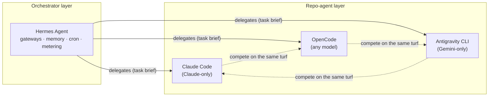

# Agent Harness Architecture

**A practitioner's deep-dive into the four agent harnesses that matter in 2026:**
**Hermes Agent · Claude Code · OpenCode · Antigravity CLI**

Everyone compares *models*. Almost nobody compares *harnesses* — the loops, context managers, tool systems, memory layers, and extension models that turn a model into a working teammate. This repo is that comparison, written by someone who operates all four daily.

---

## The four

| | Hermes Agent | Claude Code | OpenCode | Antigravity CLI |
|---|---|---|---|---|
| **Maker** | Nous Research | Anthropic | Open source community | Google |
| **License** | Open (MPL) | Proprietary (free w/ sub) | Open (MIT) | Proprietary |
| **Primary surface** | Chat gateways (Telegram/WhatsApp/Discord/Slack) + CLI | Terminal TUI | Terminal TUI | Terminal TUI + desktop 2.0 + SDK |
| **Model coupling** | Any (provider-agnostic) | Claude family | Any (BYO keys/OpenRouter/local) | Gemini family |
| **Anchored to** | A machine/home + your life | A repository | A repository | A repository + Google workspace |
| **Best described as** | Life + ops assistant | Coding agent | Open coding agent | Platform coding agent |

**Why these four?** They represent the four architectural lineages: the *gateway agent* (Hermes), the *product agent* (Claude Code), the *open agent* (OpenCode), and the *platform agent* (Antigravity — Google's shared harness in CLI form). Together they cover the design space you'll actually meet.

## The landscape

*The core thesis of this repo: the three coders fight in a triangle; the orchestrator sits above the fight.*

## Reading order

1. [01 — Hermes Agent](docs/01-hermes-agent.md) — the gateway-first life assistant
2. [02 — Claude Code](docs/02-claude-code.md) — the product coder
3. [03 — OpenCode](docs/03-opencode.md) — the open coder
4. [04 — Antigravity CLI](docs/04-antigravity.md) — the platform agent
5. [05 — Comparison & competition](docs/05-comparison.md) — where they fight + the **two-lens decision guide** (individual vs enterprise)
6. [06 — Complementary patterns](docs/06-complementary.md) — how to run them together (the reference stack)
7. [07 — Mixing antipatterns](docs/07-antipatterns.md) — what breaks when you don't

Every doc follows the same anatomy: **loop → context → tools → memory → extension model → control → cost → unique moves → failure modes** — so you can compare like-for-like.

---

*Feedback, corrections, and pull requests welcome. This is a living document — harnesses move fast.*
