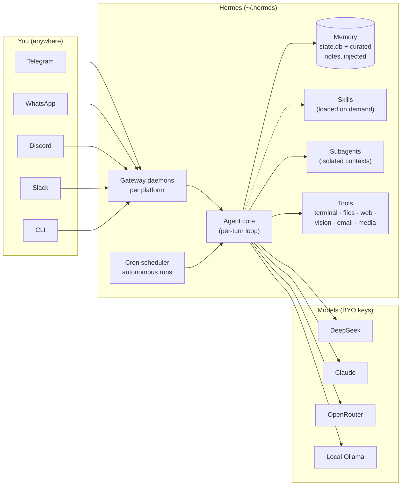
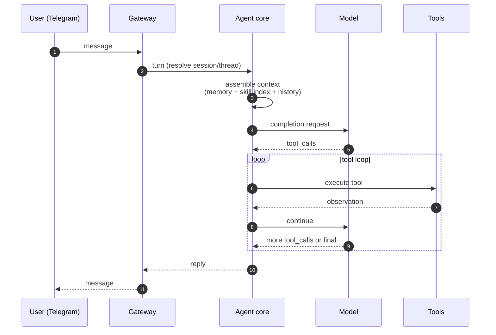

# 01 — Hermes Agent

**Maker:** Nous Research · **License:** open · **Language:** Python · **Model coupling:** none (any provider)
**One-liner:** the gateway-first harness that turns an LLM into a *life assistant* — reachable on chat platforms, running on a schedule, with persistent memory.

## Architecture at a glance

### One turn, end to end

## Architectural stance
Hermes is the odd one out in this set: it is **not repo-centric**. It is **machine- and conversation-centric**. Its home is `~/.hermes/` — a home directory, not a git checkout. It is designed to be a persistent resident of your machine that you talk to from Telegram/WhatsApp/Discord/Slack, that remembers you across sessions, and that acts on your behalf when you're not at the keyboard. Coding is one tool among ~30; life operations (email, calendar, schedules, media, research, home automation) are the point.

## The loop
Standard agent loop (model → tool calls → observations → more calls) with three structural additions:

1. **Gateway-mediated turns.** The loop is entered per-message from a chat platform (or CLI). Each platform is a *gateway* — a daemon process that receives messages, resolves the session/thread, and hands the turn to the agent core. Sessions are first-class: a Telegram thread is a session with its own history, model override, and topic.
2. **System-prompt assembly every turn.** The context window is rebuilt each turn from: system prompt + **persistent memory** (see below) + skill index + session history + tool schemas. Nothing is static.
3. **Delegation.** The loop can spawn *subagents* — isolated child contexts with their own terminal and toolset — for parallel/background work whose intermediate noise shouldn't flood the parent. Results re-enter as a message. (Nesting depth is configurable.)

## Context management
- **Per-session history** in a SQLite store (`state.db`) — every message, tool call, token count, and cost is persisted. Compaction/compression summarises long sessions; `/new` starts fresh.
- **Persistent memory** (`MEMORY.md`/`USER.md`) — curated, char-budgeted notes injected into *every* turn of *every* session. This is the harness's signature move: durable user preferences and environment facts survive session resets and are available to cron jobs and subagents.
- **Skills** — a browsable index of procedural knowledge (SKILL.md + linked scripts/references) loaded on demand into context, not stuffed in upfront.

## Tools
~30 built-in toolsets: terminal, file read/write/patch/search, web (browser automation + search), image analysis, scheduled jobs (cron), delegation, media generation, TTS, vision, computer control, plus platform tools per gateway (send messages, manage threads). Everything is a tool — including scheduling and spawning other agents.

## Memory (the differentiator)
Three layers, in order of durability:
1. `state.db` — full transcript + usage telemetry (tokens, cost per model per session)
2. Memory files — distilled durable facts, injected every turn
3. Skills — reusable procedure library, loaded on demand

No other harness in this set keeps a *cross-session curated memory* as a first-class architectural layer. Claude Code remembers your repo; Hermes remembers **you**.

## Extension model
- **Skills** (procedures + scripts), **plugins**, per-profile config
- **Cron** — scheduled autonomous runs (daily briefings, watchers, digests) that fire without a human present
- Subagents/delegation, multi-profile isolation

## Control & safety
Per-action approval modes on sensitive tools; `/approve`/`/deny`; platform-level allow/deny; model overrides per session (`/model`); YOLO mode. Out-of-band user messages can steer mid-turn.

## Cost model
Bring-your-own keys (any provider — DeepSeek/Anthropic/OpenRouter/local). Every call is metered into `state.db` per model/session; cost tracking is a built-in feature, not an add-on. Runs fine on cheap models because context discipline (memory + skills + compaction) keeps token spend low.

## Unique moves (others can't or don't)
- **Chat-platform presence**: it lives where you live (Telegram DM → full agent power from your phone)
- **Scheduled autonomous work**: cron with agent runs, watchdog scripts, monitor mode — it acts while you sleep
- **Cross-session memory**: it doesn't forget your preferences across /new
- **Multi-channel fan-out**: one brain, many gateways
- **Full transparency telemetry**: per-call cost/model ledger (queryable — we built a Sankey from it)

## Failure modes
- Session creep: long-running topics accumulate cache-read tokens (cheap but visible)
- Memory char-budget discipline requires curation (full memory starts evicting)
- Not repo-native: for single-repo coding it's a delegator, not the most ergonomic coder

*Practical note: this repo's author runs Hermes as the orchestrator and delegates coding to Claude Code/OpenCode — the pattern in [06](06-complementary.md).*
