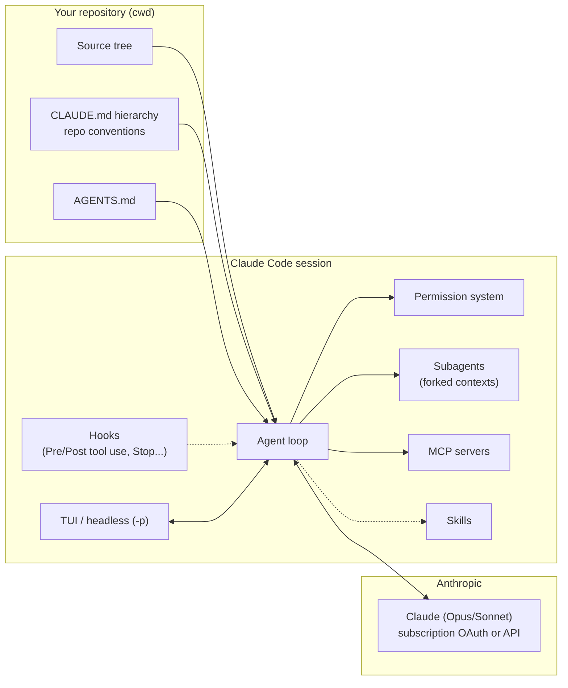
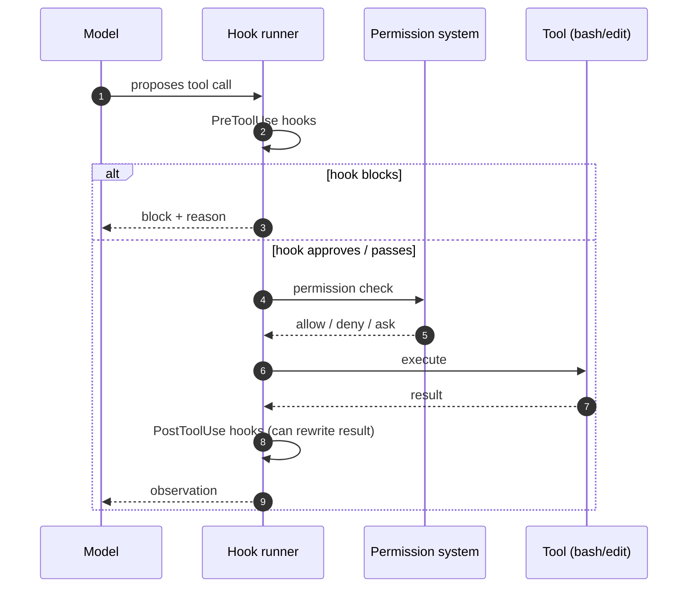

# 02 — Claude Code

**Maker:** Anthropic · **License:** proprietary (free with Claude subscription; API metered) · **Language:** TypeScript
**Model coupling:** Claude family (via subscription OAuth or API key)
**One-liner:** the product-grade coding agent — the reference implementation of "an agent that lives inside your repository."

## Architecture at a glance

### Hook lifecycle on one tool call

## Architectural stance
Claude Code is **repo-centric to the bone**. It boots in a working directory, treats the repo as the unit of work, and reads a hierarchy of instruction files (`CLAUDE.md` at repo root + subdirectories) to ground itself. Its job is software engineering in place: read the code, plan, edit, run tests, commit. It is a *product* — tightly integrated with Anthropic models, with polish (permissions UX, plan mode, diffs) that open tools struggle to match.

## The loop
Interactive session loop in the terminal (or headless via `claude -p "<task>"` for automation):
- Each turn: model proposes → tools execute (with a **permission system** — allow/deny per tool class, with remember-my-choice) → output rendered with diffs/streaming.
- **Hooks** — lifecycle events (PreToolUse, PostToolUse, Stop, etc.) where you can inject scripts that can approve, modify, or block. This is the power user's control surface.
- **Subagents** (`claude --fork` / agent tools): spawn focused child agents with custom prompts to parallelize (e.g., one reviews, one implements). Separate context, results returned to parent.
- **Plan mode**: reasoning/planning without executing mutations; review → approve → execute.

## Context management
- Conversation state per session, resumable (`--resume`), checkpointed (undo across a session).
- **CLAUDE.md hierarchy** = the repo's memory: project conventions, commands, architecture notes — read at startup and refreshed as you move through directories.
- Context compaction when the window fills (auto-summarize older turns).
- **Skills** (agent skills): SKILL.md-based procedural knowledge, loaded on demand (recent addition — brought the "skills" concept from the agent ecosystem into the product).

## Tools
Bash (sandboxed levels), file edit (string/regex + multi-edit with syntax validation), grep/search, glob, web fetch, MCP tools (any Model Context Protocol server). Tight, curated set — intentionally not a kitchen sink. Text editor integration (VS Code extension) and a browser via MCP.

## Memory
**Repo-scoped, not person-scoped**: CLAUDE.md + session resume + git history awareness. No cross-session personal memory file (that's by design — it's a work tool; your personal memory lives in your head or your orchestrator).

## Extension model
- **Hooks** (scripts at lifecycle events) — the deepest extension point
- **MCP servers** — plug in external tools/data
- **Skills** — reusable instruction+script bundles (interoperable with the wider Agent Skills ecosystem)
- Subagents, output styles, settings files (`.claude/settings.json`)

## Control & safety
Permission prompts per tool category; sandboxed bash (read-only → full); hooks can gate anything; headless mode for CI. Enterprise controls (audit, policy) on Business plans. Subscription auth ties usage to your Claude plan (fair-use caps) — this is why it's "free" with Pro/Max.

## Cost model
Two modes: **subscription** (Claude Pro/Max — usage included with fair-use limits; no per-token bill) or **API key** (metered). For individuals, the subscription route is the single most cost-effective way to run frontier-grade coding agents.

## Unique moves
- **Best-in-class Claude integration**: hooks + Opus-class reasoning + subscription economics
- **Hooks system**: the cleanest event-based control plane of the four
- **Plan → approve → execute** flow as a first-class UX
- **Multi-edit with syntax validation**: file edits are applied as validated patches, not blind writes
- Runs in **CI/headless** (`-p`) — scriptable from orchestrators (this is the delegation target in our stack)

## Failure modes
- **Model lock-in**: it's a Claude product; routing other models in is friction
- Repo-centric: no life/cron/memory across projects (pair it with a gateway agent)
- Subscription fair-use caps can throttle heavy automation
- Interactive permission prompts are friction in unattended mode (mitigated by `--dangerously-skip-permissions` or allow-lists — use with care)
