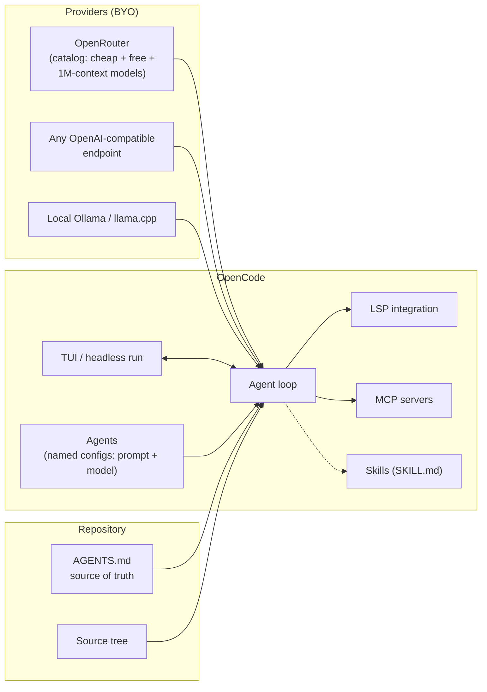
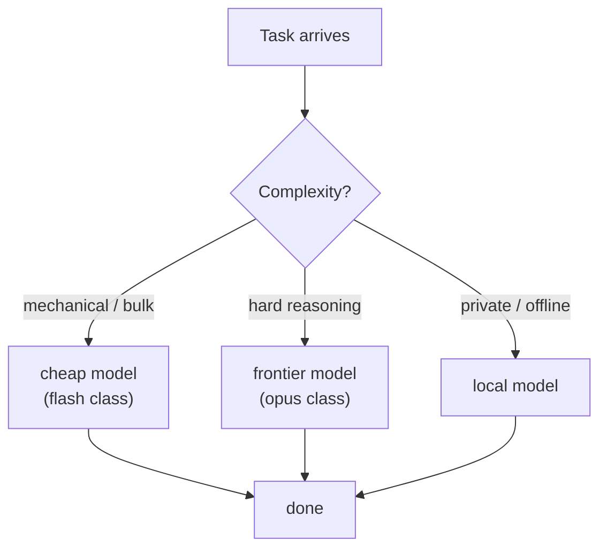

# 03 — OpenCode

**Maker:** open-source community (opencode.ai) · **License:** MIT · **Language:** TypeScript
**Model coupling:** none — any model via any provider (OpenRouter, OpenAI-compatible endpoints, local)
**One-liner:** the open, provider-agnostic coding agent — Claude Code's architecture without the lock-in.

## Architecture at a glance

### Per-task model routing

## Architectural stance
OpenCode is what you get when you take the "terminal coding agent that lives in your repo" shape and make it fully open and model-agnostic. It speaks the same language as Claude Code (repo-rooted sessions, permission-gated tools, `AGENTS.md` context) but treats the model as a pluggable resource: your DeepSeek key, your local Ollama model, an OpenRouter catalog model — any OpenAI-compatible endpoint. If Claude Code is the iPhone, OpenCode is Android: you accept less polish, you gain freedom and ownership.

## The loop
Same agentic shape: model → tool calls → observations, in either an interactive TUI or headless (`opencode run "<task>"`). Distinctive bits:
- **Agents** — named, reusable agent configurations (a prompt, a model, a temperature, a toolset) that you can invoke with `@agent-name` inside a session or via CLI. This is agent-as-configuration: the closest thing in the set to a pluggable persona system at the CLI level.
- **Provider abstraction**: one config, swap models per task — cheap model for mechanical work, frontier model for hard reasoning, local model for private code. Model routing is a first-class knob, not an afterthought.
- **LSP integration**: reads language-server intelligence (symbols, definitions) to ground edits — real editor-grade code understanding in a terminal.

## Context management
- Session-based with resume; **`AGENTS.md`** (the cross-tool convention for repo instructions — increasingly the shared standard that Claude Code, OpenCode, and others all read).
- Skills (SKILL.md bundles, compatible with the wider Agent Skills ecosystem).
- Terminal UI keeps context visible: what the model sees (files, diffs) is inspectable — transparency as a feature.

## Tools
Bash, file editing (patch-based), grep/search, LSP queries, MCP servers, web. Similar surface to Claude Code — deliberately comparable, so that switching costs stay low.

## Memory
Repo-scoped via AGENTS.md + session history. No cross-session personal memory — same stance as Claude Code; it's a work tool.

## Extension model
- **Agents** (config-as-code personas — arguably the differentiator)
- Skills, MCP servers, custom providers
- Everything in config files — your setup is versionable (dotfile-friendly)

## Control & safety
Permission prompts with allow-lists; `--auto`/`--dangerously-skip-permissions` for unattended runs; sandboxing hooks per provider. Because you bring your own key, governance is on you — there's no vendor policy layer.

## Cost model
Bring-your-own everything: BYO API keys, OpenRouter for catalog pricing, or local models at $0. This is the cheapest harness to run *well* — pair it with a cheap/free model (we ran it on a free 1M-context model for real tasks at $0.00).

## Unique moves
- **Any model, any provider** — including free/1M-context frontier-ish models the proprietary harnesses won't touch
- **Agents-as-config**: define "implementer on cheap model", "reviewer on frontier", switch mid-workflow
- LSP-grounded editing in an open tool
- **Cost arbitrage is a feature**: routing logic (cheap default, premium on demand) lives naturally here

## Failure modes
- Less product polish than Claude Code (permissions UX, multi-file edit validation, enterprise support)
- Community-maintained: docs/surface drift faster
- BYO keys = BYO security posture; no vendor-managed policy/audit
- Interactive TUI can't match gateway harnesses for remote/chat control (pair it with an orchestrator)

*Note: we used OpenCode to test-drive models the day they appeared (mystery models, free previews) — when the point is "what can this model actually do," OpenCode is the fastest way to find out.*
