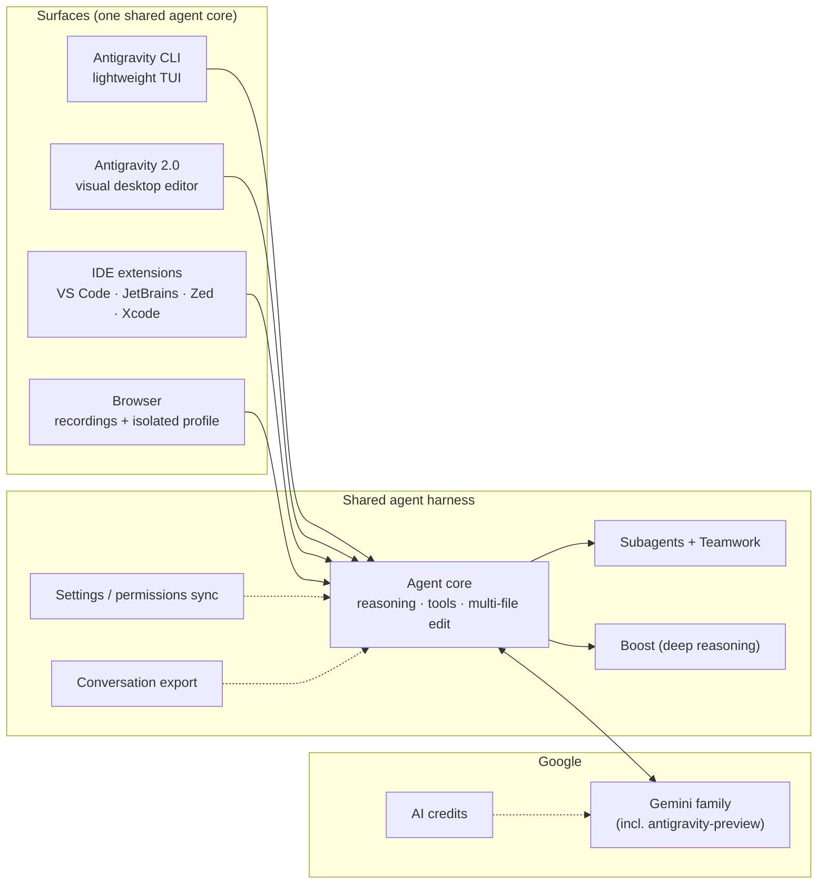

# 04 — Antigravity CLI

**Maker:** Google · **License:** proprietary (AI credits / subscription; enterprise plans) · **Language:** Go-based CLI (surface of a larger platform)
**Model coupling:** Gemini family (credits-based; enterprise auth)
**One-liner:** the terminal surface of Google's *shared agent harness* — the same agent core that powers Antigravity 2.0 desktop, IDEs, and SDKs. Successor to Gemini CLI.

## Architecture at a glance

*The distinctive move: one agent core, many surfaces, seamless handoff (a terminal session can be exported to the desktop editor and continue).*

## Architectural stance
Antigravity is architecturally the most *ambitious* entry: not a standalone agent but the CLI face of a **platform** ("Antigravity 2.0") built on one shared agent harness. The CLI (v1.x, previously Gemini CLI's lineage) is deliberately lightweight — a keyboard-driven TUI for terminal-first work — while the identical agent core runs in the desktop visual editor, IDE extensions (VS Code, JetBrains, Zed, Xcode), and the Antigravity SDK (for building your own agents with personas, MCP policies, subagents, lifecycle hooks). Google's bet: *one agent brain, many surfaces, seamless handoff.*

## The loop
Same core loop surfaced in TUI: multi-step reasoning → tool calls → multi-file editing, with conversation history, artifacts review (plans, diffs, test runs shown for approval), and plan mode. Platform-wide additions:
- **Boost (/boost)** — deep-reasoning mode (heavier thinking for hard problems)
- **Teamwork (/teamwork-preview)** — multi-agent teams with role-split conversations
- **Headless mode & background tasks** — automation without a UI
- **Voice dictation** — talk to your terminal agent
- **Agent capabilities**: permissions, sandbox, subagents

## Context management
Conversation history per session; settings/permissions **synced across surfaces** (update a permission rule in the CLI, the desktop and IDE pick it up). **Conversation export** between CLI and the visual Antigravity 2.0 when a session outgrows the terminal. Code search (/codesearch), diff review (/diff) as first-class commands. Config shared with the platform — MCP servers, plugins, skills, hooks, rules configured once.

## Tools
Shell, multi-file editing, code search, MCP, browser integrations (recordings with allow/deny lists, separate Chrome profile), artifact generation. The tool surface is broad because the platform targets end-to-end work (browser recordings alone are a differentiator).

## Memory
Workspace/project-scoped (shared harness state) — no personal cross-session memory layer of the Hermes kind. Continuity comes from the platform: projects, settings sync, conversation resume/export.

## Extension model
- **SDK (v0.1.x)**: build agents with personas, tools & skills, MCP policies, subagents, structured output, lifecycle & hooks — the most *developer-platform* extension story of the four
- Plugins, skills, hooks, MCP servers, rules
- One-time migration import from Gemini CLI (skills, extensions, settings)

## Control & safety
Permissions + sandbox; enterprise plans (policy, silent auth, managed settings); AI credits management with fallback. Google-ecosystem governance (workspace/enterprise integration) is the moat.

## Cost model
**AI credits** (subscription/premium with fallback) or enterprise billing. Gemini models only — you can't point it at DeepSeek. Model quotas visible via /usage. For individuals: premium credits ≈ subscription-like; heavy automation needs the enterprise tier.

## Unique moves (the Google-only list)
- **Browser recordings** with allowlist/denylist + isolated Chrome profile — agents that *watch and drive the web* natively
- **Shared agent harness across CLI + desktop + IDE + SDK** — no other vendor unifies surfaces on one core
- **Teamwork** (agent teams) and **Boost** (deep reasoning) as platform primitives
- **SDK + personas** — Google is positioning this as the platform *you build agents on*, not just run
- **Voice dictation** and workspace/enterprise integration

## Failure modes
- **Gemini-only**: no model arbitrage; credits ≠ open pricing; heavy use may demand enterprise
- Platform gravity: the interesting features pull you toward the desktop/SDK/Google ecosystem
- Younger than Claude Code's product iteration; previews move fast and break
- Same repo-centric limits as the other coders — no life-agent layer (pair with a gateway harness)

*Note: the model catalog confirms the platform reach — `antigravity-preview` models ship alongside Gemini in the same API surface, and the CLI inherits the full Gemini stack (vision, long context, tool use).*
