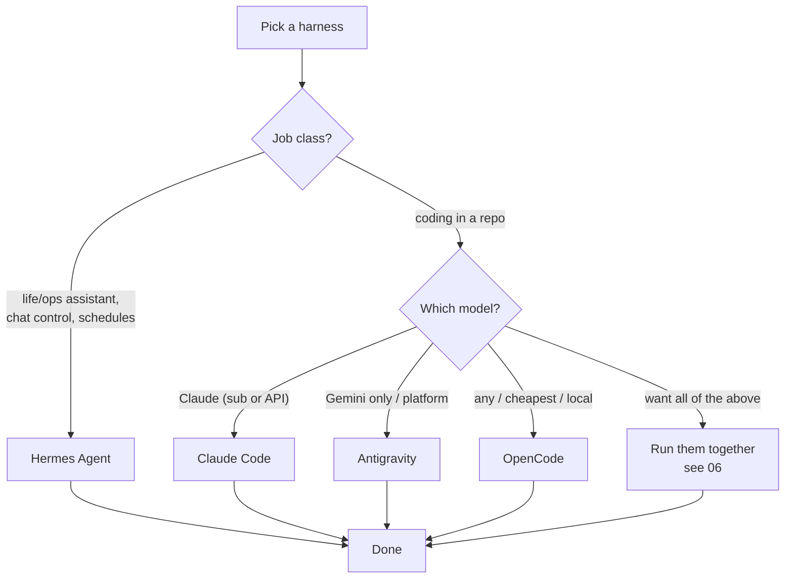

# 05 — Comparison & competition

Where the four fight, and who wins each fight.

## The matrix

| Dimension | Hermes | Claude Code | OpenCode | Antigravity CLI |
|---|---|---|---|---|
| Loop | Chat-turn agent + subagents | Session agent + subagents | Session agent + agents-config | Session agent + subagents + teams |
| Anchor | Machine/home, cross-session | Repository | Repository | Repository + Google workspace |
| Memory | 3-layer: db + curated memory + skills | Repo (CLAUDE.md) + resume | Repo (AGENTS.md) + resume | Platform state + sync |
| Model freedom | Any provider | Claude family | Any provider/local | Gemini family |
| Scheduling | **Native cron** | Via shell/hooks | Via shell | Via shell/platform |
| Chat platforms | **Native gateways** | No | No | No (workspace-adjacent) |
| Hooks/events | Plugin/tool events | **Mature hook lifecycle** | Limited | Hooks (SDK + CLI) |
| Cost control | Built-in metering | Subscription or API | BYO keys | AI credits |
| Deepest extension | Skills + plugins + cron + delegation | Hooks + MCP + skills | Agents-as-config + LSP | SDK + personas + browser + teamwork |
| Headless/CI | Yes | Yes (`-p`) | Yes (`run`) | Yes |
| Free-tier economics | BYO (cheap models OK) | Free with Pro sub (fair-use) | BYO (cheap/local OK) | Credits (Gemini only) |

## When they are competitive (head-to-head fights)

1. **Claude Code vs OpenCode vs Antigravity CLI — "in-repo coding work."** If your task is *"implement this feature in this repo"*, all three will do it. The fight is decided by: model quality (Claude Code wins if you want Claude; Antigravity if Gemini; OpenCode if you want to pick per task), extension needs (hooks → Claude Code; agents-as-config → OpenCode; platform/SDK/browser → Antigravity), and economics (subscription → Claude Code; cheap/local models → OpenCode; credits → Antigravity).

2. **Hermes vs the coding trio — only when the task is "an agent that lives in your chat and does repo work on command."** Hermes can drive repos (terminal + file tools), but it's not repo-ergonomic. If your whole workflow is single-repo coding at a desk, a coding CLI beats Hermes at its own job. Hermes wins when the *interface* is chat, the work is cross-project, or autonomy (cron) matters.

3. **OpenCode vs Claude Code — the closest civil war.** Same shape, same skills ecosystem, same repo conventions. The real differentiators: model freedom/cost arbitrage (OpenCode) vs product polish + Claude subscription + hooks maturity (Claude Code). Switching between them is cheap by design — that's why they're friendly competitors, not hostile ones.

4. **Antigravity CLI vs both coders.** Google's pitch: same agent, all surfaces, plus browser + SDK + teamwork. It competes hardest on *platform reach*; it loses on model freedom (Gemini-only) and, today, on ecosystem age.

## When they are NOT competitive (different jobs)

- **"Be my assistant across email, calendar, media, and research, reachable from my phone, working on a schedule"** → only Hermes plays (gateways + cron + memory).
- **"Edit this repo with the best Claude reasoning and let me hook into every step"** → Claude Code, no contest.
- **"Run the same agent on whatever model is cheapest today, including free previews and local"** → OpenCode.
- **"One agent harness across my terminal, IDE, desktop, and a browser recorder, managed by Google"** → Antigravity.

## Decision guide

**The honest summary:** the three coders compete in a triangle on the same turf; Hermes isn't in that turf at all — it's the orchestrator layer *above* it. Treating Hermes as "another coding agent" (or expecting a coding agent to be your life assistant) is the category error this repo exists to prevent.
