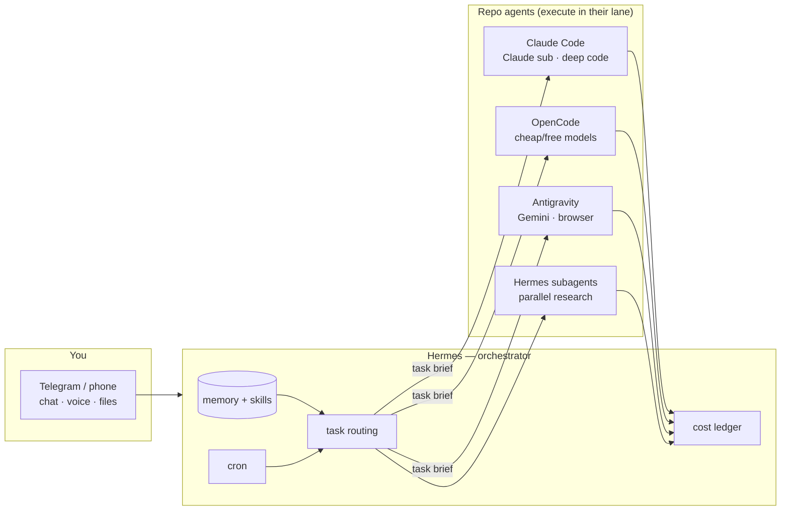
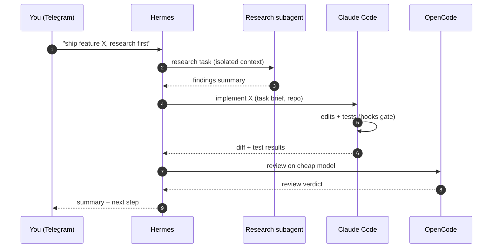

# 06 — Complementary patterns (the reference stack)

The four aren't just comparable — they compose. This is the architecture this author actually runs daily, and it generalizes.

## The reference stack: gateway-orchestrator + repo agents

**Division of labor:**
- **Hermes** owns: conversation, memory, scheduling (cron briefings/watchdogs), email/media/calendar tools, cost telemetry, and the *decision* of which coding agent gets a task.
- **Claude Code** gets: deep in-repo engineering on the Claude subscription (free, frontier).
- **OpenCode** gets: model experiments, cheap bulk, local/private work (any model).
- **Antigravity** gets: anything needing Gemini/browser recording/platform continuity.
- **Hermes subagents** get: parallel research/verification that shouldn't pollute the main context.

### The flagship recipe: research → implement → verify

## Routing rules that make it work

1. **Cheapest adequate model wins** (DeepSeek class) for reasoning/analysis in the orchestrator.
2. **Coding depth → repo agents**, never the orchestrator's generic tools (better diffs, permissions, hooks).
3. **Cost-gated capabilities** (video, music, frontier on-demand) require an explicit ask.
4. **Sensitive data stays on direct providers** — never route personal/company data through resellers or third-party aggregators.
5. **One brain for decisions** (the orchestrator); repo agents are hands, not additional brains that need babysitting.

## Composition recipes

- **"Research → implement → verify"**: Hermes subagent researches (isolated), Claude Code implements in the repo (hooks run tests), OpenCode reviews on a cheap model. Each harness does the step it's best at.
- **"Nightly digest of repo health"**: Hermes cron runs `claude -p` headless in the repo each morning, results delivered to Telegram.
- **"Try the model that dropped today"**: OpenCode `run --model <new-id>` before it's even in any product; verdict recorded in the orchestrator's eval harness.
- **"Talk to your repo from the beach"**: Telegram → Hermes → Claude Code headless → diff summary back to Telegram.

## The boundary rules

- The **orchestrator** is the only thing that talks to chat platforms, holds long-term memory, and runs schedules.
- **Repo agents** are the only things that mutate repositories.
- **One repo agent per worktree/session at a time** (see antipatterns).
- Cost telemetry lives in the orchestrator (single ledger), not per-CLI.
