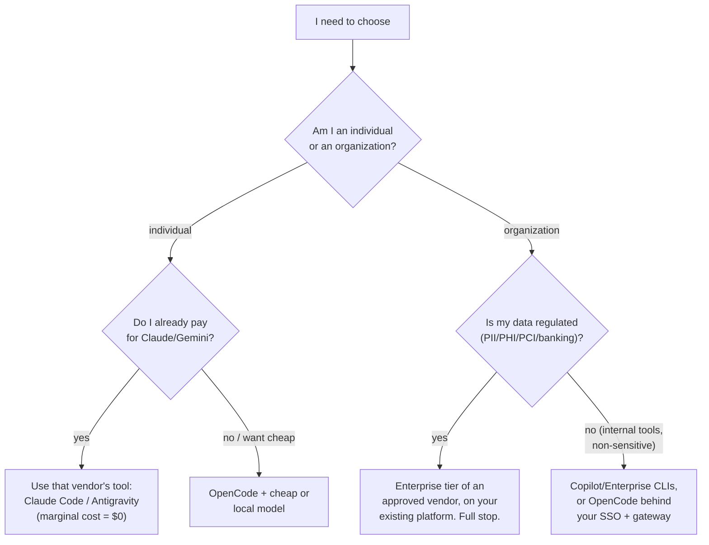

# 08 — How to actually choose (the takeaway)

Everything before this doc was understanding. This doc is deciding. If you read nothing else, read this.

## The 30-second answer

| If you are... | Pick | Runner-up | Skip |
|---|---|---|---|
| Solo dev with a **Claude subscription**, one repo, want max code quality fast | **Claude Code** | OpenCode | Antigravity (unless Gemini-shop) |
| Solo/indie, **cost-sensitive**, no sub, want cheap + local + free models | **OpenCode** | — | Vendor products (metered) |
| **Google shop** (heavy GWS, Gemini credits, enterprise GCP) | **Antigravity** | Claude Code | OpenCode (no platform support) |
| **Enterprise architect** picking for a regulated org | **vendor enterprise tier on your platform** (Claude Code Enterprise / Antigravity Enterprise / Copilot — per procurement) | — | Any BYO-key/consumer-grade tool |
| **Researcher / model-tester** ("what can this new model do?") | **OpenCode** | — | products (locked to one family) |
| Want an **assistant for life + code**, phone control, schedules | **Hermes orchestrator** + a coder below it | — | any single coder alone |
| **Privacy/offline** work | **OpenCode + local model** | Claude Code (enterprise self-host where available) | cloud-only tools |

**Not sure? Default answer:** *individual* → **Claude Code if you have the sub, OpenCode if you don't.** *Enterprise* → **ask procurement, not the internet.**

## The 4-question path



## The one-line verdicts

- **Use Claude Code if** you want the best Claude reasoning in a repo with the most mature hooks/permissions, and a sub makes it effectively free.
- **Use OpenCode if** you want model freedom (cheap/free/local), agents-as-config, or you're evaluating models — and you're fine owning your setup.
- **Use Antigravity if** you're a Google/Gemini shop, want one agent across terminal + IDE + desktop + browser recordings, and credits/enterprise fit your billing.
- **Use Hermes if** you want the agent to live in your chat, remember you across sessions, run on schedules, and *delegate* coding to the tools above.

## What to do right now (kickstarts)

**Chose Claude Code:**
```bash
npm install -g @anthropic-ai/claude-code   # or: brew install --cask claude-code
claude auth login                          # ties to your Pro/Max sub
cd your-repo && claude                     # add a CLAUDE.md first
```

**Chose OpenCode:**
```bash
curl -fsSL https://opencode.ai/install | bash
opencode auth login                        # or export OPENROUTER_API_KEY
cd your-repo && opencode                   # add AGENTS.md first
```

**Chose Antigravity:**
```bash
# install per your platform (docs: antigravity.google) — migrates from Gemini CLI
agy auth login                             # credits / enterprise SSO
agy                                       # in your repo
```

**Chose Hermes (orchestrator pattern):**
```bash
# install Hermes, connect Telegram, then delegate:
# "use Claude Code for this feature" → Hermes runs `claude -p "<brief>"` headless
```

## The 10-second discipline that makes any choice work

1. **One harness per worktree** — never two agents editing the same repo.
2. **One instruction file** — AGENTS.md (or CLAUDE.md pointing at it).
3. **Model is a dial, not an identity** — change it per task, not per tool.
4. **In an org: if it's not in the approved catalog, it doesn't exist.**
5. **Pick, then stop picking** — your hooks/configs/skills compound only if you stay put for a cycle.

*For the deeper reasoning behind these choices (and why the model doesn't pick the harness), see [05](05-comparison.md). For running them together, [06](06-complementary.md). For what breaks, [07](07-antipatterns.md).*
